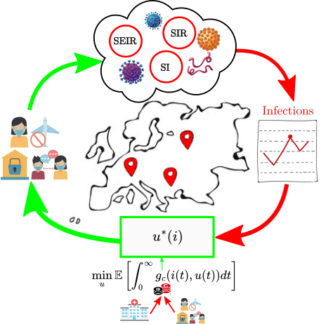

# Documentation for the code related to the paper *Fundamental limits on taming infectious disease epidemics*


## Table of Contents
- [Project description](#introduction)
- [Directory structure](#directory-structure)
- [Getting started](#Getting-started)
## Project description

**Contributors**

This research was conceived and led by Giovanni Pugliese Carratelli and Ioannis Lestas with the contribution of Kris Varun Parag and Xiaodong Cheng.

**Summary**

This repository provides the code, some examples and data files used to generate the results presented in the paper r *Fundamental limits for taming infectious disease* which investigates how during an epidemic prevalence signals can be ineffective to tame the spread of a disease. Below is an overview of article and the directory structure and a list of computer code sources is provided in the [directory structure section](#directory-structure).


We consider the problem of finding transmission mitigation measures $u^\ast$ that minimise the social/economic costs $g_c(i,u)$ due to $i$ infected and intervention $u$ over an indefinite amount of time (see Figure). 



*Establishing strategy design principles for epidemics is a complex task. In our paper we make use of the above schema in order to address this issue for arbitrary complex epidemics optimising over interventions for a large class of practically relevant costs.*

We model the epidemics as stochastic jump models that accurately describe the evolution of the epidemics in that only rates can be controlled rather than individual events. We consider a wide class of cost functions that depend arbitrarily on interventions and scale with infections and we demonstrate that increasing infections are not associated with increasingly restrictive measures. The optimal policies are also constant with respect to prevalence implying no incentive to adjust the optimally chosen transmission rate to respond to the rapidly changing infection prevalence. After exhaustive computations we find that our results hold for arbitrary complex stochastic compartmental models and for a very broad class of epidemic and cost parameters. We identify these generic features of the optimal policies via provably exact analytical and computational tools.

An overview ot the code base is provided below.

## Directory Structure

There are two main folders, `code/` and `plots/`. `code` contains all the scripts used to generate the data files. These include ```C++``` code as well as ```Matlab``` code. `script_plots` contains several data processing files and will contain the code and material that is needed to reconstruct the figures of the paper and the supplementary material.
The requirements for the codebase are provided in each of the folders. But a quick start guid is outlined in the [Getting started section](#Getting-started)


---

The content of `code/` and as well as a short description of the content is provided below.
  - **SIR/**: Contains the ```Matlab``` code and functions related to computation of the optimal policies as well as the stochastic simulations for the time-evolution of the Markov Jump process version of the *Stochastic Infectious Recovered* model we consider.
  - **SEIR/**: Contains the ```Matlab``` code and functions related to computation of the optimal policies as well as the stochastic simulations for the time-evolution of the Markov Jump process version of the *Stochastic Exposed Infectious Recovered* models we consider.
  - **SI/**: Contains the ```C++``` and  ```Matlab``` code and functions related to the computation of the optimal policies as well as the stochastic simulations for the time-evolution of the Markov Jump Process version of the *Stochastic Infectious* models we consider.

<details>
<summary> Content of `code/SI` </summary>

- **`readme.md`**: Readme file providing the requirements to run the code and guidance on how to run the files in the folder and/or change parameter over which to do computations. The file also provides guidance how to process the resulting data.

- **`SI_Model_ValueIteration.m`**: `Matlab` function that will compute the optimal policy for the SI model for a specific parameter configuration single 

- **`SI_PolicyComputation.cpp`**: `C++` file that will compute the optimal policy for the SI model for a specific range of parameters of interest 

- **`SI_Bursts_PolicyComputation.cpp`**: `C++` file that will compute the optimal policy for the SI model when considering infection bursts (i.e. when an infection event can lead to a random number of infected individuals) for a specific range of parameters of interest

- **`SI_Gillespie.m`**: `Matlab` script implementing the Stochastic Simulation Algorithm in order to obtain the trajectories of an SI epidemic. The function runs multiple times in parallel for specific set of parameters and can be adapted to incorporate parameter variations.
</details>

<details>
<summary> Content of `code/SIR` </summary>

- **`readme.md`**: Readme file providing the requirements to run the code and guidance on how to run the files in the folder and/or change parameter over which to do computations. The file also provides guidance how to process the resulting data.

- **`SIR_PolicyComputation.m`**: `Matlab` script that will compute the optimal policy for the SIR model for a specific parameter configuration. 

- **`SIR_BurstPolicyComputation.m`**: `Matlab` script that will compute the optimal policy for the SIR model for a specific parameter configuration i the presence of bursts, i.e. when an infection event can lead to a random number of infected individuals. 

- **`SIR_Gillespie.m`**: `Matlab` script implementing the Stochastic Simulation Algorithm in order to obtain the trajectories of an SIR epidemic. The function runs multiple times in parallel for specific set of parameters and can be adapted to incorporate parameter variations.

</details>

<details>
<summary> Content of `code/SEIR` </summary>

- **`readme.md`**: Readme file providing the requirements to run the code and guidance on how to run the files in the folder and/or change parameter over which to do computations. The file also provides guidance how to process the resulting data.

- **`SEIR_PolicyComputation.m`**: `Matlab` function that will compute the optimal policy for the SEIR model for a specific parameter configuration. 

</details>
---

The folder `script_plots/` contains data processing files  and after the review process is finalised will contain sub-folders that are named after figures in the paper. The sub-folders will include the relevant figure, the data and the code that was used to generate the figure.

## Getting started
The specific instructions to run a computation are provided in each folder. Here we provide a quick start guide to run some low scale computations. 

The code base is written in ```C++``` and ```Matlab```. Specifically:

- The ```C++``` code has been written and tested using the `g++` compiler in a Linux environment. In order to run a computation, the user must specify the parameters in the considered `.cpp` file and save the file with a text editor (as discussed below, default parameters ensure reasonable computation times). The considered file then has to be compiled and run using the following commands:

    ```console
    foo@bar:~$ g++ -o filetorun.o hello.cpp
    foo@bar:~$ ./filetorun.o
    ```

    *N.B.* The computation time can be long in certain parameter configurations and for large parameter grids. The default parameters are set to obtain a solution in a relatively short amount of time on a modern computer. However, in order to obtain the optimal policies for large populations and a wide range of parameters, it is advised to:

    - Run the code in a High Performance Computing environment (HPC)  
    - Make use of the `openmp` `g++` compiler parameter for parallel computation

 

- The ```Matlab``` only requires the parallel computation toolbox for the time simulations. Once the considered file has been opened in the `Matlab` environment editor and the parameter have been chosen it is sufficient to press the `"Run"` button or `F5`.
